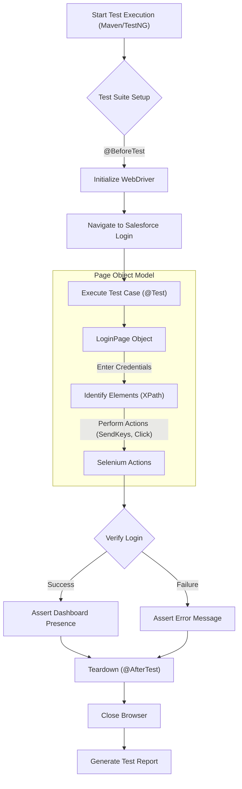

# MyPlaywright_framework

Welcome to the **MyPlaywright_framework** repository! This project serves as a comprehensive automation testing suite, showcasing implementations of industry-standard testing frameworks.

Currently, the repository features a robust **Selenium with Java** automation framework designed for enterprise-level testing, specifically targeting Salesforce login functionality.

## 📂 Project Structure

The project is organized as follows:

- **`promots_RicePot/`**: Contains the core automation resources.
  - **`SeleniumFramework/`**: The main Maven project containing the source code and tests.
  - **`RicePot.md`**: Specifications and prompt details for the Selenium framework implementation.

## 🔄 Automation Flow Diagram

The following diagram illustrates the execution flow of the automation suite, from test initialization to result verification.



## 🚀 Features

- **Enterprise-Grade Architecture**: Built using the Page Object Model (POM) design pattern with PageFactory for maintainability and scalability.
- **Robust Error Handling**: Implements structured try-catch blocks and explicit exception handling.
- **Test Management**: Utilizes **TestNG** for test execution, annotations (`@Test`, `@BeforeTest`), and assertions.
- **Locator Strategy**: Exclusively uses **XPath** locators for precise element identification.
- **Build Automation**: Managed with **Maven** for dependency management and build lifecycle.

## 🛠️ Tech Stack

The framework is built using a modern and robust stack of technologies ensuring reliability, scalability, and ease of maintenance.

| Component | Technology | Description |
| :--- | :--- | :--- |
| **Language** |  | Core programming language for script development. |
| **Automation Core** |  | WebDriver for browser interaction and automation. |
| **Test Runner** |  | Framework for test management, assertions, and reporting. |
| **Design Pattern** | **Page Object Model (POM)** | Design pattern for creating an object repository for web UI elements. |
| **Build Tool** |  | Dependency management and build lifecycle automation. |
| **Version Control** |  | Distributed version control system. |

## 🏁 Getting Started

### Prerequisites

Ensure you have the following installed on your system:
- **Java JDK** (version 8 or higher)
- **Maven**
- **Git**

### Installation

1.  **Clone the repository**:
    ```bash
    git clone https://github.com/aaabhishekgole/MyPlaywright_framework.git
    ```

2.  **Navigate to the framework directory**:
    ```bash
    cd MyPlaywright_framework/promots_RicePot/SeleniumFramework
    ```

3.  **Install dependencies**:
    ```bash
    mvn clean install
    ```

### Running Tests

To execute the test suite, run the following command from the `SeleniumFramework` directory:

```bash
mvn test
```

## 🔮 Future Roadmap

- **Playwright Integration**: Incorporate Playwright for modern, fast, and reliable end-to-end testing (aligning with the repository name).
- **Expanded Test Coverage**: Add more complex test scenarios beyond authentication.
- **CI/CD Integration**: Set up automated pipelines for continuous testing.

---
*Created by [Abhishek Gole](https://github.com/aaabhishekgole)*
